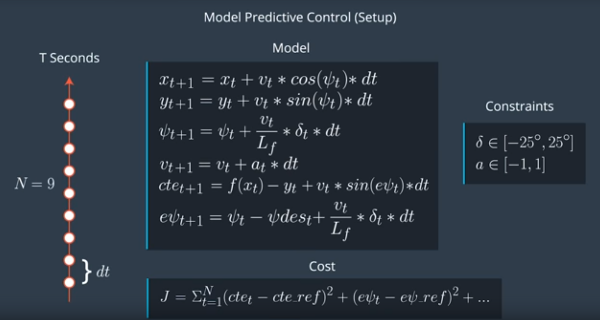

# Model Predictive Controller Project

## Introduction

The purpose of the project is to implement a Model Predictive controller in C++ to maneuver the vehicle around the track. The [simulator](https://github.com/udacity/self-driving-car-sim/releases) communicates position of car, speed and heading direction as well as wayback points along with a reference trajectory that the car is to follow. The coordinates are provided in Global coordinate system. Unlike PID Controller, this time the cross track error is not given but has to be calculated. The simulator There's a 100 millisecond latency between actuations commands on top of the connection latency.

The rubric of the project can be found [here](https://review.udacity.com/#!/rubrics/896/view).

## Rubric Reflection

### The Model

*Student describes their model in detail. This includes the state, actuators and update equations.*

The model used is kinematic Model. The model includes the vehicle's position - `x,y` coordinates, orientation angle denoted by `psi`,velocity `v`,cross-track error `cte` and psi error `epsi`. Actuator outputs are acceleration `a` and delta (steering angle). The model combines the state and actuations from the previous timestep to calculate the state for the current timestep based on the equations below:



`Lf` is the distance between the center of mass of the vehicle and the front wheels and affects the maneuverability. 

### Timestep Length and Elapsed Duration (N & dt)

*Student discusses the reasoning behind the chosen N (timestep length) and dt (elapsed duration between timesteps) values. Additionally the student details the previous values tried.*

The time `T=N*dt` defines the prediction horizon. Short prediction horizons result in controllers which are responsive but not accurate but long duration horizon result in smoother controllers. Likewise, if we set high N, simulation runs slower as the solution has to optimize more control inputs, but if N is smaller, the solution is not able to optimize the required control inputs.

I started with N=25 and dt=0.05 as it was mentioned in the lecture, but the vehicle  leaves the track.

Here are the changes I noticed:

| N    | dt   | Result                                   |
| ---- | ---- | ---------------------------------------- |
| 25   | 0.05 | Vehicle leaves the track. Video.         |
| 20   | 0.05 | Vehicle leaves the track. Video.         |
| 15   | 0.1  | Vehicle completes the track with some fluctuations |
| 15   | 0.15 | Vehicle complets track with slower velocity |
| 12   | 0.1  | Vehicle completes the track              |
| 10   | 0.1  | Vehicle completes the track.             |

So, I end up at N=12(over N=10) and dt=0.1. 

These values mean that the optimizer is considering around 1.2 second prediction horizon duration in which it has to determine a corrective trajectory. 

Another varying parameters were weights set for calculating the costs associated with various model parameters like velocity, orientation, change in acceleration etc.

```c++
    const double w_cte = 3000; // Weight for cross-track error
    const double w_epsi = 3000;// Weight for error in orientation
    const double w_dv = 1;// Weight for deviation from reference velocity
    const double w_delta = 5000;// Weight for use of steering
    const double w_a = 5000;// Weight for use of throttle
    const double w_d_delta = 200;// Weight for sudden turns
    const double w_d_a = 10;// Weight for sudden accelerations or braking
```

The above weights penalize parameters, for instance w_cte changes cost function to minimize CTE. 

### Polynomial Fitting and MPC Preprocessing

*A polynomial is fitted to waypoints.*

*If the student preprocesses waypoints, the vehicle state, and/or actuators prior to the MPC procedure it is described.*

The wayback points are preprocessed by transforming them from global coordinate system to vehicles local coordinate system(main.cpp):

```c++
for (int i = 0; i < ptsx.size(); i++) {
	double dx = ptsx[i] - px;
	double dy = ptsy[i] - py;

	trans_waypoints_x.push_back(dx * cos(-psi) - dy * sin(-psi));
	trans_waypoints_y.push_back(dx * sin(-psi) + dy * cos(-psi));
                    }
```

Then we use 3rd order polynomial to fit current road curve :

```c++
auto coeffs = polyfit(trans_waypoints_x_eigen, trans_waypoints_y_eigen, 3);
```

Generally speaking, 3rd order polynomial should be a good fit of most roads. Using a smaller order polynomial runs the risk of underfitting while higher order will result in overfitting. 

### Model Predictive Control with Latency

*The student implements Model Predictive Control that handles a 100 millisecond latency. Student provides details on how they deal with latency.*

We have a dt=0.1, which is equal to 100ms. 100ms latency imply that the controls of the first step are not used in optimization. To overcome this, we compute the state with this delay factor  and then feed it to mpc model to solve it.

Here is the code from main.cpp:

```c++
double curr_px = v * dt;
double curr_py = 0.0;
double curr_psi = -v * steer_value * dt / Lf;
double curr_v = v + throttle_value * dt;
double curr_cte = cte + v * sin(epsi) * dt;
double curr_epsi = epsi + curr_psi;

Eigen::VectorXd state(6);
state << curr_px, curr_py, curr_psi, curr_v, curr_cte, curr_epsi;

auto vars = mpc.Solve(state, coeffs);
```

### Summary

The car drives better than the PID controller touching maximum speed of around 90MPH. I feel further tweaking can be done with the weights used in calculating the cost function.